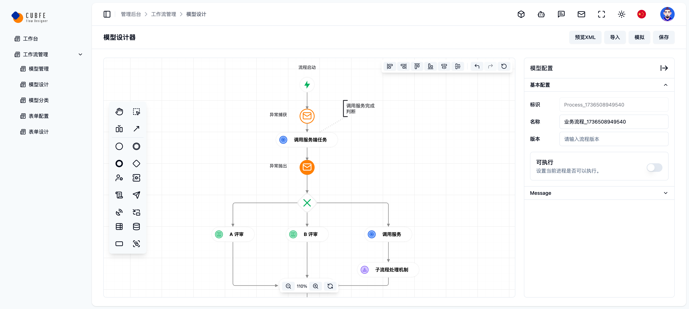
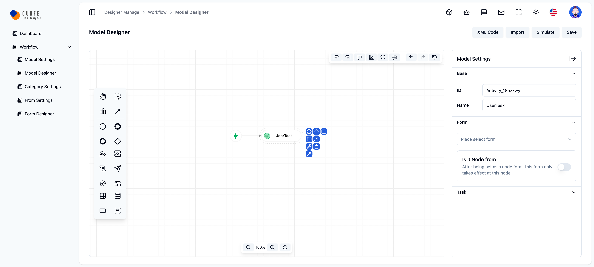
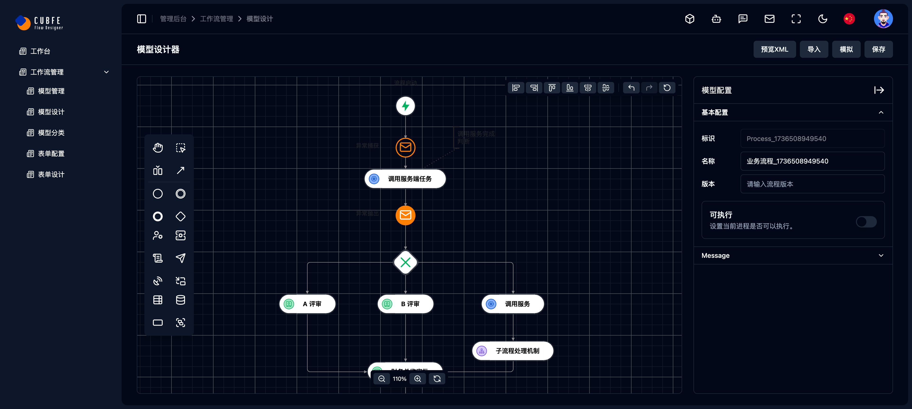

<p align="center">
  <a href="https://cubfe.com">
    
  </a>
</p>
<h1 align="center">CUBFE-FLOW-DESIGNER</h1>
<p align="center">
  <a href="https://github.com/vuefront/vuefront"></a>
  <a href="https://www.npmjs.com/package/vuefront"></a>
  <a href="https://www.npmjs.com/package/vuefront"></a>
  <a href="https://discord.gg/C9vcTCQ"></a>
</p>

## 简介
这是一个基于bpmn.js与 flowable 为核心建立的流程设计框架，美化原有的设计面板与属性面板，实现中英双语切换
此方案为基础版本布局类型框架后续组件以及内容卡片自行补充

## 预览地址
<a href="https://cubfe.github.io/cubfe-bpmn-template/" target="_blank">https://cubfe.github.io/cubfe-bpmn-template/</a>

## 技术栈

- **Vue 3**: 用于构建用户界面的渐进式JavaScript框架。
- **Vite**: 下一代前端开发与构建工具。
- **TailwindCSS**: 一个高度可定制的低级CSS框架。
- **Shadcn-vue**: 基于 tailwindcss + radix-vue 打造的前端 UI 组件库。
- **TypeScript**: 为JavaScript添加了静态类型。

## 核心组件
- **bpmn-js**: 流程设计器
- **Axios**: 用于发送HTTP请求的流行库。
- **Pinia**: 新一代的状态管理库，灵感来自于Vuex。
- **i18n**: 国际化插件，帮助管理多语言支持。
- **Router**: Vue Router，用于构建单页面应用（SPA）的路由管理。

## 特性

- **高性能**: 得益于Vite的快速构建和热重载。
- **现代设计**: 使用TailwindCSS，快速创建响应式和美观的UI。
- **类型安全**: 全面使用TypeScript，提升开发体验和代码质量。
- **轻松扩展**: 通过Pinia和i18n，轻松实现状态管理和国际化。
- **简单配置**: 基于Vue 3和Router，快速上手并构建单页面应用。

## 环境
- **Node.js**: 18.17.0 或更高版本
- **npm**: 10.8.1 或更高版本

## 快速开始

1. 克隆仓库
    ```bash
    git clone https://github.com/your-repo/vue3-frontend-framework-template.git
    cd vue3-frontend-framework-template
    ```

2. 安装依赖
    ```bash
    npm install
    ```

3. 启动开发服务器
    ```bash
    npm run dev
    ```

4. 构建生产环境
    ```bash
    npm run build
    ```

5. 预览
http://localhost:3001





## 贡献

欢迎贡献！请 fork 此仓库并提交PR以参与开发。

## 许可证

MIT License. 请参阅 [LICENSE 文件](./LICENSE) 了解更多详细信息。
